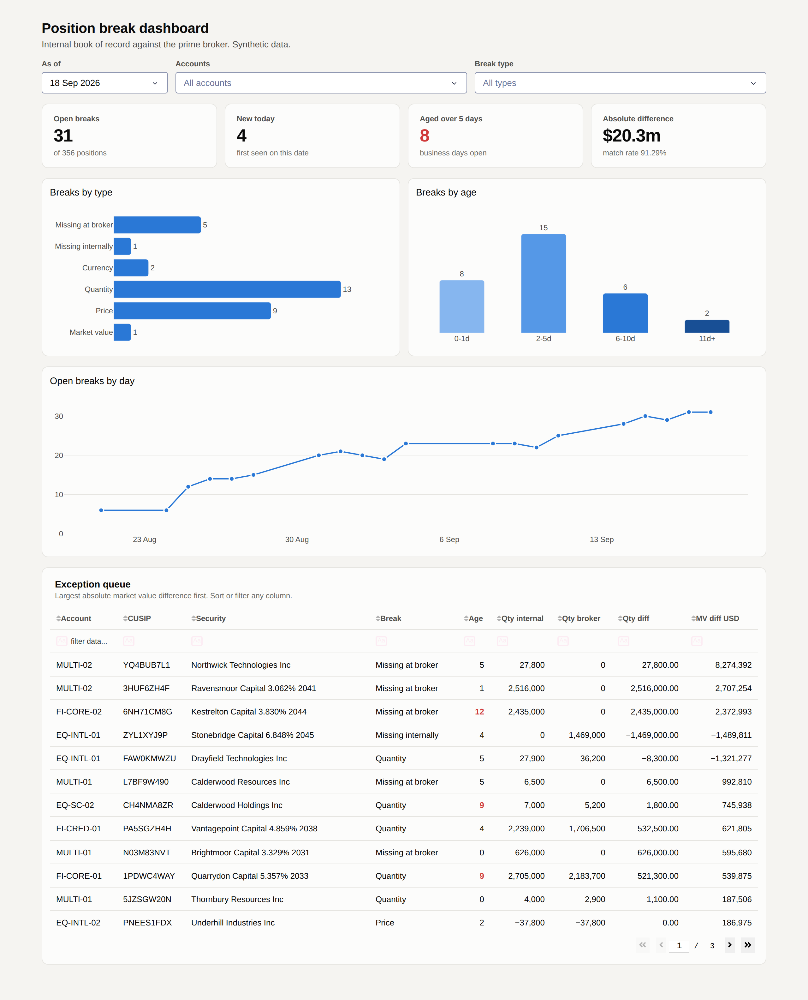
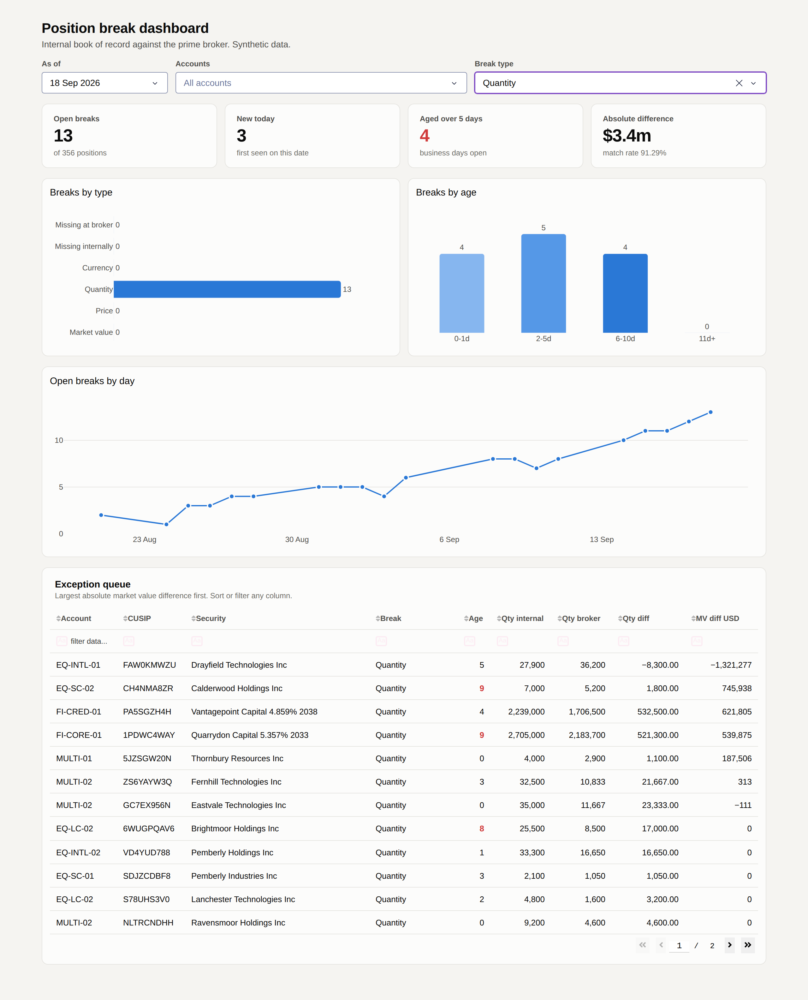

# Position break dashboard

A daily reconciliation between an internal book of record and a prime broker
position file, with the break queue on a Plotly Dash dashboard. The data is
synthetic and generated by this repo. No client data is involved.



## Quickstart

```bash
pip install -e ".[dev]"      # runtime plus pytest and ruff
python -m recon.generate     # write 20 trading days of synthetic feeds
python -m recon.pipeline     # normalize, reconcile, age the breaks
python -m app.dashboard      # http://127.0.0.1:8050
pytest                       # 95 tests
```

Tested on Python 3.11 with pandas 3.0, numpy 2.4, dash 4.4 and plotly 7.1.
CI runs the linter, the tests and the pipeline on 3.11, 3.12 and 3.13.

## What it does

```
data/raw/internal/      internal extract, one row per position, signed quantities
data/raw/prime_broker/  broker file, lot level, side flag, formatted numbers
        |
        v
recon.normalize     one schema: map accounts, parse dates, sign shorts,
                    aggregate lots, clean identifiers, reject duplicate grain
        |
        v
recon.reconcile     full outer join on (date, account, security),
                    one vectorized classification pass
        |
        v
recon.aging         trading day age per break, over the full history
        |
        v
data/output/        breaks_history.csv, daily_summary.csv  ->  app.dashboard
```

The two feeds disagree about almost everything except the economics. The broker
uses its own account codes, `MM/DD/YYYY` dates, positive quantities with a
separate long or short flag, thousands separators inside quoted strings, and
reports tax lots rather than positions. Normalization resolves all of that so
the comparison itself stays short.

## Break types

Rules are ordered and the first match wins. The order encodes what has to be
true before the next comparison means anything: a position missing on one side
is never reported as a difference against zero, and a currency disagreement is
raised before any number is compared across two currencies.

| Break | Rule | What causes it in the generated data |
|---|---|---|
| `MISSING_IN_PB` | present internally, absent at the broker | a position the broker has not picked up |
| `MISSING_IN_INTERNAL` | present at the broker, absent internally | a position booked only at the broker |
| `CURRENCY_BREAK` | both sides present, currency codes differ | the broker's security master has the wrong trading currency |
| `QUANTITY_BREAK` | quantities differ by more than 0.01 | a trade booked one side only, or an equity split the broker has not applied |
| `PRICE_BREAK` | prices differ by more than 1bp of the internal price | a stale mark, or a bond marked dirty against a clean internal price |
| `MARKET_VALUE_BREAK` | quantity and price agree, value differs by more than 5bp and $1 | a different FX rate on a non USD position |

A position reported flat internally that the broker has dropped is a match, not
a missing position. Book of record extracts carry zero rows for closed
positions and brokers correctly omit them.

Default tolerances live in `recon.config.Tolerances` and are passed in rather
than read from a global, so a test can widen one and assert the effect.

## Design decisions worth arguing about

**A break is a position, not a difference.** The key is `(account, security)`.
If a quantity break becomes a price break while it is still open, it stays the
same item in the queue and keeps its age. Ops are investigating a position, not
a field.

**Age separates identity from duration.** Two different questions, answered two
different ways. Identity walks the sequence of dates actually reconciled, so
neither a market holiday nor a broker file that never arrived splits one break
into two. Duration is trading days elapsed on the NYSE calendar in
`recon.calendar`. An earlier version inferred identity from calendar gaps and
counted Monday to Friday, which reset every open break's clock on Thanksgiving
and re-flagged the whole queue as new.

**A clean day is not a gap.** A day on which everything matched contributes no
rows to the break history, so the pipeline passes the dates it ran to the aging
rather than letting it infer them from the rows present.

**Identifier columns are read as strings, everywhere.** Most CUSIPs are numeric
and most of the Treasury range is. Left to dtype inference, `037833100` arrives
as `37833100` and matches nothing in the security master. Worse, inference is
per file, so one side can keep the leading zero while the other loses it, and
one matching position becomes two breaks and twice its market value in
difference.

**Relative tolerances scale off the internal book.** `np.isclose(pb, internal,
rtol=...)` applies the tolerance to the second argument, and the internal book
is the reference we are measuring the broker against. Fifty cents is a break on
a $25 equity and a match on a $25,000 instrument.

**The market value tolerance has an absolute floor.** The broker values each tax
lot separately, so lots sum back to within a cent or two of the position rather
than exactly. A $1 floor absorbs that without hiding anything that matters.

**Differences are absolute in every rollup.** Two quantity breaks of +$50k and
-$120k are $170k of work, not -$70k of exposure. Netting them would understate
the queue.

**Duplicate grain is rejected, not reconciled.** A re-delivered file or a book
split by strategy without the strategy in the key fans out across the join into
paired breaks that net to nothing. Both the internal feed and the join itself
refuse it rather than producing a plausible wrong answer.

**Classification is one vectorized pass.** `np.select` over a list of conditions
rather than a row-wise `apply`, which keeps the rules in one readable list and
does not degrade as the book grows.

**The summary is per account, not per day.** A dashboard filtered to one account
needs that account's match rate. A firm-wide figure sitting beside a filtered
break count reads as a reconciled number and is not one.

**Charts carry no value axis.** Every bar is labelled directly, and the reader is
comparing a handful of numbers rather than estimating them off a scale. Age gets
a single hue ramp because age is ordered and darker reading as older is the
point. Break type keeps a fixed axis with zeros shown, so the chart does not
rearrange itself when a filter changes:



## Layout

```
src/recon/
  config.py      tolerances, break labels, the break key
  calendar.py    the NYSE trading calendar the aging runs on
  generate.py    synthetic feeds with seeded break episodes
  normalize.py   both feeds onto one schema
  reconcile.py   the join and the classification rules
  aging.py       trading day aging over the break history
  pipeline.py    the daily run
app/
  views.py       every number the dashboard shows, as plain functions
  figures.py     Plotly figures
  dashboard.py   layout and callbacks
  theme.py       colours and display labels
tests/           95 tests
```

`app/views.py` imports no Dash. The callback reads the filters, hands them to
these functions and passes the result to the figures, so the part that decides
what a number means is tested without starting a browser.

## Tests

```
tests/test_normalize.py   format differences, lot aggregation, the errors raised
tests/test_reconcile.py   each rule, the order they fire in, tolerance behaviour
tests/test_aging.py       consecutive days, holidays, unreconciled days, reopened
                          breaks, buckets
tests/test_views.py       KPIs, rollups, filters, the exception queue
tests/test_pipeline.py    generate, run, a planted break, a numeric CUSIP
```

The pipeline test generates a fresh dataset into a temporary directory, runs the
whole thing, and checks that counts tie back to the summary per day and per
account and that a second run produces an identical frame.

## Scope

This is a portfolio project, not a production system. What it deliberately does
not do:

- **No accrued interest.** The canonical schema carries a price and a market
  value. A dirty mark is modelled as a price difference, not as a clean price
  plus separate accrued, which is what a real fixed income reconciliation needs.
- **No factored instruments.** An absolute par tolerance is meaningless against
  MBS current face; the generator only emits whole par amounts, so it never
  bites here.
- **Regular holidays only.** `recon.calendar` is a rule set, so an ad hoc
  closure such as a state funeral would have to be added as an explicit date.
  Production would take this from the exchange calendar service.
- **Files, not tables.** The history is one CSV rather than a table with an
  upsert, there is no scheduler or alerting, tolerances are one global set
  rather than configured per account, and there is nowhere for an analyst to
  record what they found.
- **Light theme only** on the dashboard.
